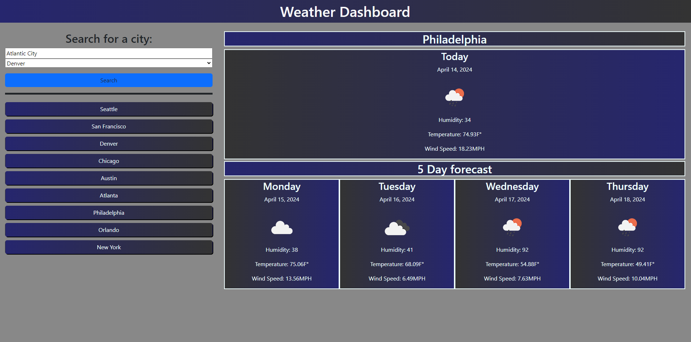

### Weather Dashboard
Find the weather for any city by typing the city name.

# Summary

This weather dashboard can display the weather for today and include a 5 day forecast. The weather card will display the city name, weather, temperature, humidity, and wind speed. To use it the user can input a city name into the search bar and select search. the weather will display with the forecast under it. The input will save to local storeage to reference in the drop down. The user can also select a button to display the weather for that city without any input.

# Link to Deployed Weather dashboard

https://milkytea6.github.io/weather-dashboard/

# Link to GitHub Repository

https://github.com/Milkytea6/weather-dashboard

# Screenshot of Weather Dashboard

